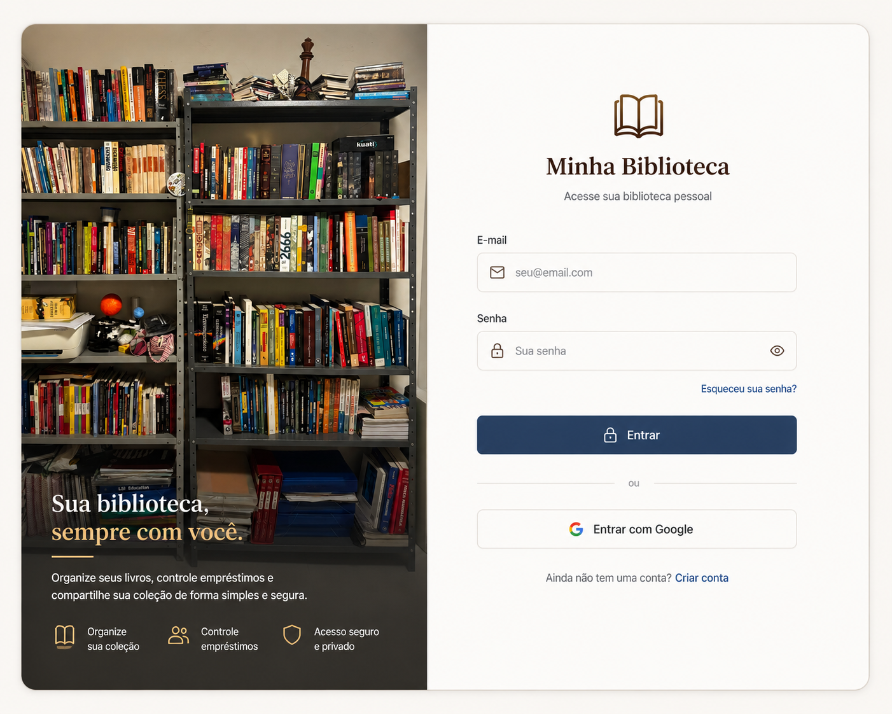
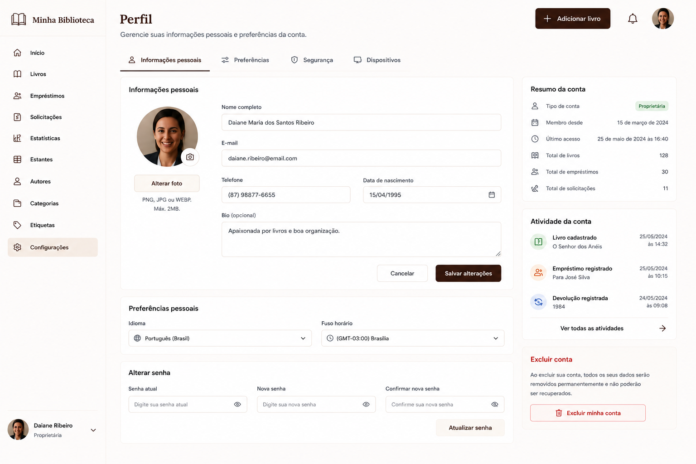

# Especificação das Telas

## Sistema de Gerenciamento de Biblioteca Pessoal

**Versão:** 1.0
**Status:** Aprovado para implementação

---

# 1. Objetivo

Este documento descreve todas as telas aprovadas para o Sistema de Gerenciamento de Biblioteca Pessoal.

Seu objetivo é servir como especificação visual e funcional da interface do sistema, complementando o Design System e a SDD do projeto.

Cada tela apresenta:

- objetivo;
- principais componentes;
- regras de interface;
- observações de implementação;
- referência visual.

Este documento deve ser utilizado juntamente com:

- `docs/SDD-sistema.md`;
- `docs/design/design-system.md`.

---

# 2. Dashboard (Home)

## Objetivo

Apresentar uma visão geral da biblioteca pessoal, permitindo acesso rápido às principais funcionalidades e indicadores do sistema.

## Componentes

- Sidebar
- Barra superior
- Banner com fotografia da biblioteca
- Botão "Adicionar livro"
- Cards de estatísticas
- Livros adicionados recentemente
- Empréstimos ativos
- Categorias mais utilizadas

## Regras

- Utilizar a fotografia da biblioteca como banner.
- O banner deve conter o nome da biblioteca.
- Os cards devem reutilizar o componente padrão definido no Design System.
- Todos os indicadores devem utilizar o mesmo padrão visual.

## Navegação

A partir desta tela o usuário poderá acessar todas as demais funcionalidades do sistema.

## Referência visual

---

# 3. Login

## Objetivo

Permitir a autenticação do usuário.

## Componentes

- Banner com fotografia da biblioteca
- Formulário de login
- Campo de e-mail
- Campo de senha
- Botão Entrar
- Link "Esqueci minha senha"

## Regras

- Utilizar a fotografia da biblioteca.
- Manter layout simples e limpo.
- Exibir mensagens de erro abaixo dos campos quando necessário.

## Referência visual

---

# 4. Biblioteca

## Objetivo

Permitir o gerenciamento completo do acervo.

## Componentes

- Barra de pesquisa
- Filtros
- Ordenação
- Cards dos livros
- Paginação
- Botão "Adicionar livro"

## Regras

- Exibir capa apenas quando fornecida pelo Google Books.
- Caso contrário utilizar placeholder.
- Os cards devem manter altura uniforme.

## Referência visual

---

# 5. Cadastro de Livro

## Objetivo

Cadastrar novos livros utilizando ISBN ou preenchimento manual.

## Componentes

- Campo ISBN
- Botão Buscar
- Dados do livro
- Botão Salvar

## Regras

Fluxo principal:

ISBN

↓

Google Books

↓

Preenchimento automático

↓

Confirmação

Caso não exista resultado:

- permitir preenchimento manual;
- não permitir upload de capa.

## Referência visual

---

# 6. Detalhes do Livro

## Objetivo

Apresentar todas as informações de um livro.

## Componentes

- Capa
- Dados bibliográficos
- Descrição
- Categorias
- Notas pessoais
- Histórico

## Regras

- Manter notas pessoais.
- Exibir placeholder quando não houver capa.

## Referência visual

---

# 7. Solicitações

## Objetivo

Permitir o gerenciamento das solicitações de empréstimo.

## Componentes

- Lista de solicitações
- Status
- Pesquisa
- Filtros
- Paginação

## Regras

As solicitações deverão utilizar os componentes padronizados de listas definidos no Design System.

## Referência visual

---

# 8. Empréstimos

## Objetivo

Gerenciar os empréstimos realizados.

## Componentes

- Lista de empréstimos
- Botão Novo Empréstimo
- Pesquisa
- Filtros
- Paginação

## Dados registrados

- Livro
- Pessoa
- Telefone
- E-mail
- Origem do contato
- Data do empréstimo
- Data da devolução
- Status

## Regras

Os únicos status permitidos são:

- Emprestado
- Devolvido

Não utilizar:

- data prevista de devolução;
- lembretes;
- próximo do vencimento;
- em atraso.

## Referência visual

---

# 9. Configurações

## Objetivo

Centralizar as configurações do sistema.

## Componentes

- Preferências
- Configurações da biblioteca
- Conta
- Aparência

## Regras

Todos os grupos deverão utilizar o componente padrão de Card.

## Referência visual

---

# 10. Perfil

## Objetivo

Permitir a atualização dos dados do usuário.

## Componentes

- Foto
- Nome
- E-mail
- Senha
- Botão Salvar

## Regras

Todos os campos devem utilizar o componente padrão de formulário.

## Referência visual

---

# 11. Página Pública

## Objetivo

Disponibilizar uma página pública para compartilhamento da biblioteca.

## Componentes

- Banner
- Nome da biblioteca
- Estatísticas
- Livros
- QR Code
- Compartilhamento

## Regras

- Utilizar a fotografia da biblioteca como banner.
- Manter identidade visual semelhante ao Dashboard.
- Exibir apenas livros públicos.

## Referência visual

---

# 12. Observações Gerais

Todas as telas devem:

- reutilizar os componentes definidos no Design System;
- manter identidade visual consistente;
- utilizar a mesma tipografia;
- respeitar a paleta de cores;
- manter os espaçamentos definidos;
- utilizar os mesmos componentes de formulário;
- utilizar os mesmos componentes de cards;
- utilizar os mesmos componentes de listas;
- utilizar os mesmos estilos de botões;
- preservar a experiência visual minimalista e acolhedora.

---

# 13. Critério de Aprovação

A implementação será considerada aprovada quando:

- todas as telas reproduzirem fielmente as referências visuais;
- todos os componentes reutilizarem o Design System;
- todas as regras descritas neste documento forem respeitadas;
- a identidade visual permanecer consistente em toda a aplicação;
- a navegação estiver de acordo com a SDD do sistema.
